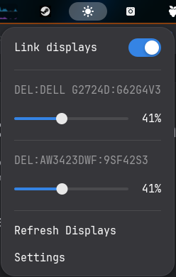

# DDC Brightness Control

This project aims to be a simple and easy to use DDC brightness control plugin for Gnome



## Features

- Brightness control via panel
- Adjustable keybindings for brightness controls
    - Active screen detection
    - By default, keybinding is alt+shift+f1/f2 for down/up on the active display
- Display linking if you want to adjust all displays at once

## Planned Features?

- Would be nice to get this added to the system status menu at some point isntead of its own dot
- Support for direct i2c or better ddc controllers (not ddcutil)
- You tell me

## Installation

(Examples use arch, but all packages should be available on other distros as well)

Be sure to have [ddcutil](https://www.ddcutil.com/) installed it is a hard requirement for now

Also, if installing from source install just which is the chosen command runner for this project

```bash
sudo pacman -Syu ddcutil just
```

Add your user to the i2c group so it can use i2c without root and reboot/login+out

```bash 
sudo usermod -aG i2c $USER
reboot
```

Now install the extension from version control
(until we get to the gnome extension store)

```bash 
git clone https://github.com/lucasoskorep/ddc-brightness-control
cd ddc-brightness-control
just install
```

## Development

You need a couple of other things for development ideally

- uv
- fnm

### Installation
```bash
just install
```

### Linting
```bash
just lint
just lint-fix #(auto fixes what it can via eslint)
```

### Debugging
```bash
just live-debug
```


