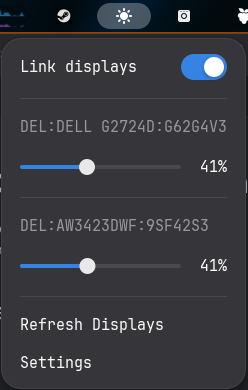

# DDC Brightness Control

This project aims to be a simple and easy to use DDC brightness control plugin for Gnome



## Features

- Brightness control via panel
- Adjustable keybindings for brightness controls
    - Active screen detection
    - By default, keybinding is alt+shift+f1/f2 for down/up on the active display
- Display linking if you want to adjust all displays at once

## Planned Features?

- Would be nice to get this added to the system status menu at some point instead of its own dot
- Support for direct i2c or better ddc controllers (not ddcutil)
- You tell me

## Requirements

Regardless of how you install the extension, it shells out to
[ddcutil](https://www.ddcutil.com/) to talk to your monitors, so it is a hard
requirement.

```bash
sudo pacman -S ddcutil
```

Then add your user to the `i2c` group so `ddcutil` can talk to the bus without
root, and re-login (or reboot):

```bash
sudo usermod -aG i2c $USER
reboot
```

## Installation

Pick whichever method fits you. All three install the same extension — the
store and manager routes are the easiest, building from source gives you the
latest commits.

### 1. GNOME Extensions Website (easiest)

Head to the listing and click **Install**:

<https://extensions.gnome.org/extension/10312/ddc-brightness-controller/>

Clicking Install opens the browser connector. If prompted, install the
"Shell Extension Manager" browser extension for your browser, approve the
connection, and the extension installs straight into your running session.

### 2. GNOME Extensions Manager App

Search for **"DDC Brightness Controller"** in the
[Extensions](https://flathub.org/apps/details/com.mattjakeman.GNOME.Extensions)
app (from Flathub) and hit install. On X11 the same app also lets you install
directly from the website link above.

### 3. From Source (git clone)

Builds the extension locally and drops it into your user's extension dir.
Requires [just](https://github.com/casey/just) as the command runner.

Arch Linux:

```bash
sudo pacman -S git just
```

Clone and install:

```bash
git clone https://github.com/lucasoskorep/ddc-brightness-control
cd ddc-brightness-control
just install
```

After installing from source, enable it (toggle in the Extensions app, or):

```bash
gnome-extensions enable ddcbrightness@lucaso.io
```

Re-login or restart the shell (`Alt+F2` → `r` on X11) to pick it up.

## Development

Building and debugging locally needs a few extra tools beyond the runtime
requirements above:

- `just` — the command runner
- `fnm` — fast node version manager (the build runs on Node via pnpm)
- `uv` — python package manager (used by the schema-analysis helper)
- `glib2` — provides `glib-compile-schemas` for compiling the settings schema

Arch Linux:

```bash
sudo pacman -S just fnm uv glib2
```

Set up the Node runtime with fnm (the pinned version lives in `.node-version`):

```bash
fnm install
fnm use
```

Then:

```bash
just install      # install deps + build + drop into the extension dir
just lint         # lint
just lint-fix     # auto-fix what eslint can
just live-debug   # tail gnome-shell logs while you poke at it
```
